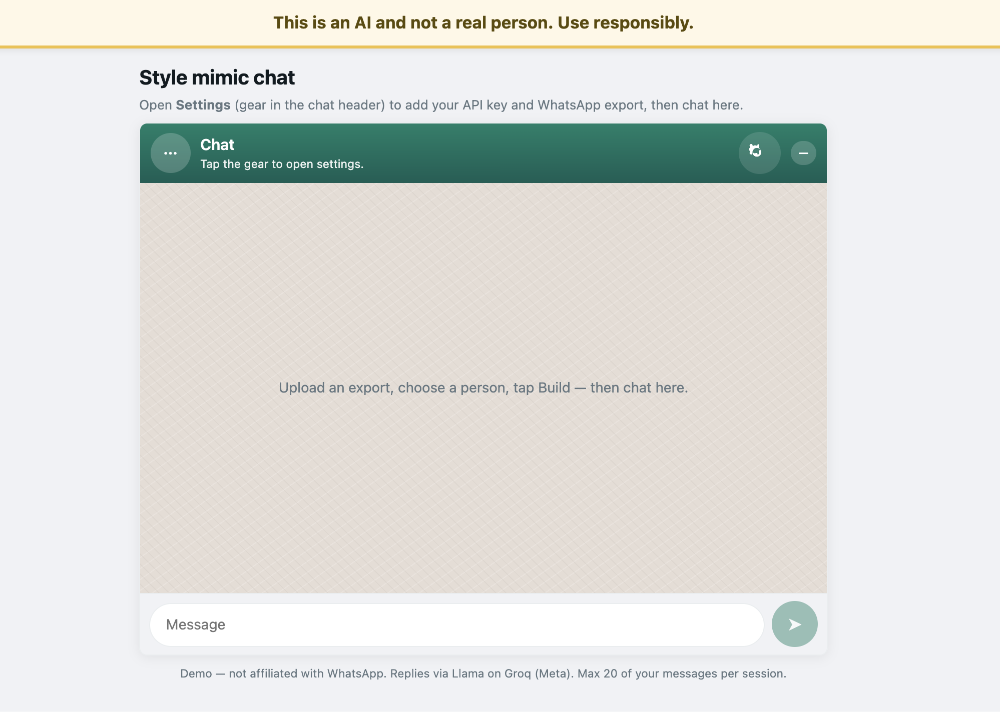
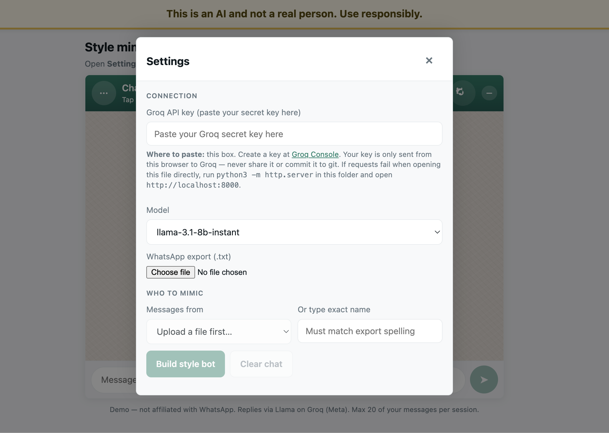

<div align="center">

# 🧠 MemoryBot

### *Talk to anyone — even those who are gone.*

**An AI-powered chat bot that learns and mimics the exact texting style of any real person their language, humour, slang, emoji usage, and personality powered entirely in your browser.**

[](https://vivekr43.github.io/MemoryBot/)
[](https://github.com/vivekr43/MemoryBot)
[](https://groq.com)
[-00C853?style=for-the-badge)](https://github.com/vivekr43/MemoryBot)

</div>

---

## 💡 The Idea Behind MemoryBot

MemoryBot was born from a deeply human question: *What if you could talk to someone even when they're no longer there?*

There are two core use cases that inspired this project:

---

### 👻 POV 1 — Reconnect with Someone You've Lost

> Imagine losing a close friend, a parent, or someone you loved. Their texts, their jokes, their specific way of saying things all of that is preserved in your WhatsApp chat history.
>
> MemoryBot reads that history and recreates their conversational soul. It speaks the way they spoke. It uses the phrases they used. It matches their humour and energy. It's not a replacement but it can be a way to feel close, to grieve, or to simply say the things you never got to say.

This is for anyone who wants to preserve a memory, not just in photos and videos, but in *conversation*.

---

### 📱 POV 2 — Your Friend, But Always Online

> Your best friend is abroad, in a different timezone, or just perpetually offline. But you want to chat.
>
> MemoryBot can become a **digital twin** of that person trained on their actual WhatsApp messages. It'll roast you the same way, use the same inside jokes, and even type with the same random capitalisation and questionable punctuation they do.

Think of it as a **fun, personalised chatbot** of someone you know for banter, nostalgia, or just testing how well the AI has learned their vibe.

---

## 📸 Screenshots

| Main Chat Interface | Settings Panel |
|---|---|
|  |  |

> *WhatsApp-style UI with real-time AI responses mimicking your chosen person's style*

---

## ✨ Features

- **📤 WhatsApp Export Upload** — Drop in your `.txt` WhatsApp chat export; no account access required
- **👤 Person Picker** — Automatically detects all participants; choose who to mimic
- **🧠 Style Learning** — Analyses vocabulary, punctuation patterns, emoji use, and sentence length to build a style profile
- **💬 WhatsApp-Accurate UI** — Pixel-perfect replica of WhatsApp Web with real chat bubbles, avatars, timestamps, and typing indicators
- **🔒 100% Private** — Everything runs in your browser; your chat data never leaves your device (only the AI-extracted style prompt is sent to Groq)
- **⚡ Instant Responses** — Powered by Llama 3.1 on Groq's ultra-fast inference API
- **📱 Mobile Responsive** — Works beautifully on phone screens too
- **🛡️ Ethical Guardrails** — Persistent disclaimer reminding users this is AI, not a real person; 20-message session limit

---

## 🚀 How to Use

### Step 1 — Export Your WhatsApp Chat
1. Open WhatsApp on your phone
2. Go to any chat → tap the **three dots (⋮)** → **More** → **Export Chat**
3. Choose **Without Media**
4. Save the `.txt` file to your device

### Step 2 — Get a Free Groq API Key
1. Go to [console.groq.com/keys](https://console.groq.com/keys)
2. Sign up for free and create an API key
3. Copy the key (it starts with `gsk_...`)

### Step 3 — Set Up MemoryBot
1. Open [MemoryBot](https://vivekr43.github.io/MemoryBot/)
2. Click the **⚙️ gear icon** in the green chat header
3. Paste your Groq API key
4. Upload your WhatsApp `.txt` export
5. Select the person to mimic from the dropdown
6. Click **"Build style bot"**

### Step 4 — Start Chatting!
Type your message and hit send. Watch the bot respond exactly the way that person would.

---

## 🛠️ Tech Stack

| Layer | Technology |
|---|---|
| **Frontend** | Vanilla HTML, CSS, JavaScript |
| **AI Model** | Llama 3.1-8B Instant (Meta) |
| **AI API** | [Groq](https://groq.com) (ultra-fast LLM inference) |
| **Hosting** | GitHub Pages |
| **Chat Parsing** | Custom WhatsApp export parser (regex-based) |
| **Backend** | None — fully client-side |

---

## 🔒 Privacy & Ethics

> ⚠️ **Important**: MemoryBot is a powerful tool. Please use it responsibly.

- **Your raw chat data never leaves your browser.** Only a style summary (not actual messages) is sent to Groq's API for AI responses.
- **Always get consent** before building a bot of a living person — especially for sharing with others.
- **Be mindful of grief.** Using this to recreate someone who has passed is a deeply personal choice. It can be healing, but also overwhelming.
- The app displays a persistent disclaimer: *"This is an AI and not a real person."*
- Sessions are limited to **20 messages** to encourage intentional use.

---

## 🏃 Run Locally

```bash
# Clone the repo
git clone https://github.com/vivekr43/MemoryBot.git
cd MemoryBot

# Serve locally (needed to avoid CORS issues when using file://)
python3 -m http.server 8000

# Open in browser
open http://localhost:8000
```

> **Note:** You can also just open `index.html` directly in Chrome/Firefox — it works for most use cases, but serving it via localhost avoids any potential CORS restrictions.

---

## 🔮 Potential Future Features

- [ ] **Voice synthesis** — Generate audio responses in the person's tone
- [ ] **Multi-language support** — Detect and match Hinglish, regional languages, etc.
- [ ] **Memory persistence** — Save chat sessions locally (IndexedDB)
- [ ] **Style strength slider** — Control how strictly the bot mimics vs. improvises
- [ ] **Custom persona details** — Add context like "they love cricket and hate Mondays"
- [ ] **Group chat mode** — Mimic multiple people in one conversation
- [ ] **Mobile app** — React Native wrapper for native feel

---

## 🤝 Contributing

PRs and ideas are welcome! If you've got a wild idea for how to make MemoryBot even more eerily accurate, open an issue or fork the repo and go for it.

---

## 📄 License

MIT License — do whatever you want, just don't be weird about it.

---

<div align="center">

Made with 💚 and a little existential curiosity.

*"Some people leave. Their words don't have to."*

</div>
